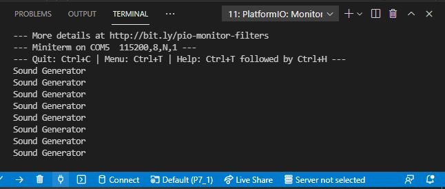

# PRACTICA 7_1  : Reproducción desde memoria interna

## 1.Salida del terminal

Si tenemos a mano un altavoz conectado al amplificador de clase D, observamos que, para cada línea de "Sound Generator", escuchamos a un hombre hablando.

## 2.Explicación del código

En este apartado de la práctica 7, se trabaja con datos de sonido que se almacenan como una matriz en la RAM interna del ESP32. Para decodificar esos datos de audio digitales a una señal analógica que se pueda reproducir mediante un altavoz, se utiliza la placa MAX98357 con protocolo I2S.

El código comienza con las definiciones de las librerias necesarias en este caso y, de 3 variables relacionadas con el audio (in, aac, out).

En el setup, incializamos el Serial y, le asignamos a la variable in la siguiente línea: "new AudioFileSourcePROGMEM(sampleaac, sizeof(sampleaac))", cuya función es importar el archivo de audio y su tamaño. A la variable aac, se le asigna "new AudioGeneratorAAC()" para poder decodificar audio en formato ".aac". Y, por otro lado, a la variable out se le asigna "new AudioOutputI2S()", cuya función es utilizar el protocolo I2S para poder establecer la ganancia de audio y los pines de salida, tal y como se muestra más tarde. En cuanto a la línea "aac->begin(in, out)", esta relaciona la entrada con la salida.

En el loop, primero de todo, si el bucle corre, el aac decodifica. Si, por lo contrario, el bucle no corre, el aac deja de decodificar y aparece por el terminal la línea "Sound Generator".